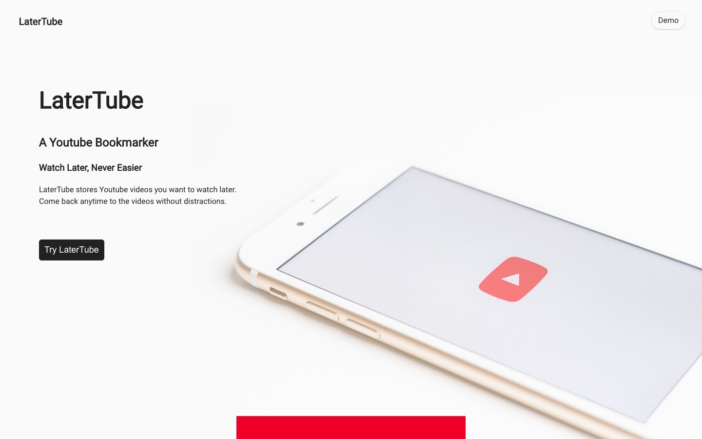
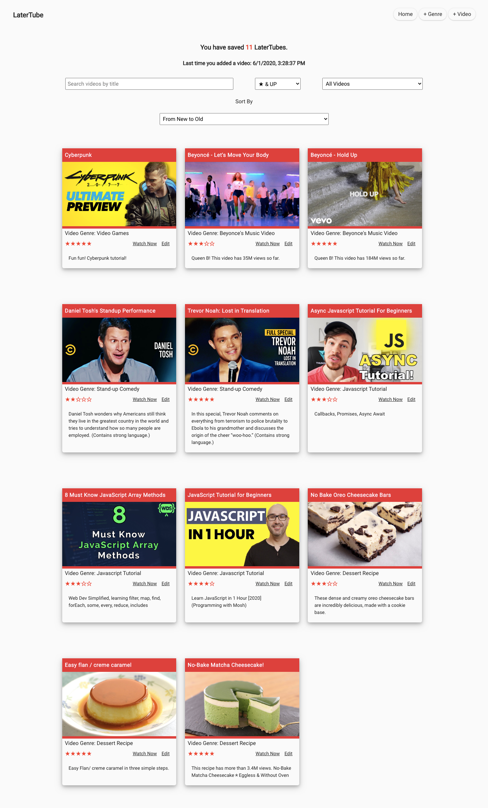
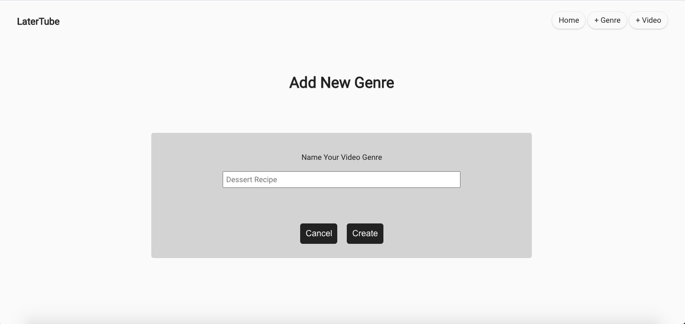
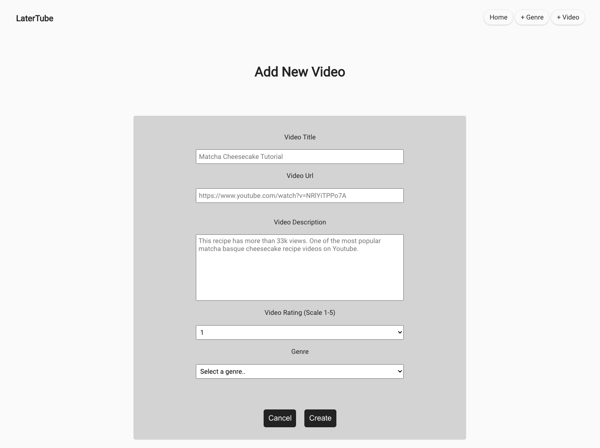

# LaterTube: A Youtube Bookmarker

Link to Live Demo: https://latertube-app.now.sh/

## What is LaterTube?

LaterTube stores Youtube videos you want to watch later. Come back anytime to the videos without distractions.

##Features##

- *Categorization:* Users can create their own video genres (video types) and store the videos under matching genres.

- *Personalization:* Users can rate the videos, re-name the videos and give brief introductions. This is a personalized watch-later playlist, free from any annoying and unwanted purchased ads and banners.

- *Watch in one-click:* Click on the "watch now" button and go directly to the Youtube.

## Technology Used
- React
- CSS
- JEST